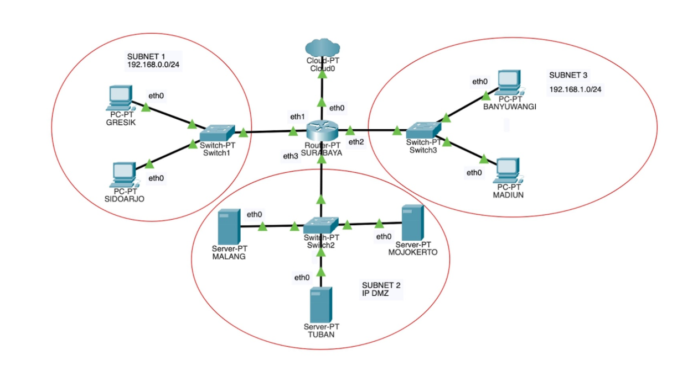

# **Jarkom_Modul3_Lapres_B14**
### Anggota Kelompok:
- IQBAAL PRATAMA PUTRA  (05111840000021)
- DWI WAHYU SANTOSO     (05111840000121)

## Topologi:
- SURABAYA    : Router
- Subnet1     : 
  - Switch1
  - GRESIK    : Client
  - SIDOARJO  : Client
- Subnet2     :
  - Switch2
  - TUBAN     : DHCP Server
  - MALANG    : DNS Server
  - MOJOKERTO : Proxy Server
- Subnet3     :
  - Switch3
  - BANYUWANGI: Client
  - MADIUN    : Client

## Soal:
1. Seluruh client TIDAK DIPERBOLEHKAN menggunakan konfigurasi IP Statis.  
2. SURABAYA ditunjuk sebagai perantara (DHCP Relay) antara DHCP Server dan client.  
3. Client pada subnet 1 mendapatkan range IP dari 192.168.0.10 sampai 192.168.0.100 dan 192.168.0.110 sampai 192.168.0.200.  
4. Client pada subnet 3 mendapatkan range IP dari 192.168.1.50 sampai 192.168.1.70.  
5. Client mendapatkan DNS Malang dan DNS 202.46.129.2 dari DHCP.  
6. Client di subnet 1 mendapatkan peminjaman alamat IP selama 5 menit, sedangkan client pada subnet 3 mendapatkan peminjaman IP selama 10 menit.  
7. User autentikasi memiliki format:  
   - User : userta_b14  
   - Password : inipassw0rdta_b14  
8. Penggunaan internet setiap hari Selasa-Rabu pukul 13.00-18.00.  
9. Jadwal bimbingan setiap hari Selasa-Kamis pukul 21.00 - 09.00 keesokan harinya (sampai Jumat jam 09.00).  
10. Setiap dia mengakses google.com, maka akan di redirect menuju monta.if.its.ac.id.  
11. Mengubah error page default squid menjadi seperti berikut:  
  
12. Menggunakan proxy cukup dengan mengetikkan domain janganlupa-ta.b14.pw dan memasukkan port 8080.  

## Langkah-langkah pengerjaan:

**1. Konfigurasi IP client.**  
- Edit file `topologi.sh` sebagai berikut:  
  
- Edit file `/etc/network/interfaces` pada SURABAYA sebagai DHCP Relay dengan konfigurasi seperti berikut:  
  
- Edit file `/etc/network/interfaces` pada BANYUWANGI sebagai Client dengan konfigurasi seperti berikut:  
  
- Edit file `/etc/network/interfaces` pada MADIUN sebagai Client dengan konfigurasi sebagai berikut:  
  
- Edit file `/etc/network/interfaces` pada GRESIK sebagai Client dengan konfigurasi sebagai berikut:  
  
- Edit file `/etc/network/interfaces` pada SIDOARJO sebagai Client dengan konfigurasi sebagai berikut:  
  
- Edit file `/etc/network/interfaces` pada MALANG sebagai DNS Server dengan konfigurasi sebagai berikut:  
  
- Edit file `/etc/network/interfaces` pada MOJOKERTO sebagai Proxy Server dengan konfigurasi sebagai berikut:  
  
- Edit file `/etc/network/interfaces` pada TUBAN sebagai DHCP Server dengan konfigurasi sebagai berikut:  
  

**2. Surabaya sebagai DHCP Relay.**  
- Edit file `/etc/sysctl.conf` pada SURABAYA dengan merubah `ip_forward` menjadi 1.  
  
- Install DHCP Relay dengan menjalankan perintah `apt-get install isc-dhcp-relay`.  
  
- Edit file `/etc/default/isc-dhcp-relay` dengan memasukkan IP TUBAN dan interfaces yang digunakan.  
  
- Restart DHCP Relay dengan menjalankan perintah `service isc-dhcp-relay restart`.  
  
- Install DHCP Server pada TUBAN dengan menjalankan perintah `apt-get install isc-dhcp-server`.  
  
- Edit file `/etc/default/isc-dhcp-server` dengan memasukkan `eth0`.  
  
- Restart DHCP Server dengan menjalankan perintah `service isc-dhcp-server restart`.  
  

**3. Subnet1 range IP 192.168.0.10 sampai 192.168.0.100 dan 192.168.0.110 sampai 192.168.0.200.**  
- Edit file `/etc/dhcp/dhcpd.conf` pada TUBAN dengan memasukkan subnet 1 range yang sudah ditentukan.  
  
- Test pada GRESIK apakah telah mendapatkan IP.  
  
- Test pada SIDOARJO apakah telah mendapatkan IP.  
  

**4. Subnet3 range IP 192.168.1.50 sampai 192.168.1.70.**  
- Edit file `/etc/dhcp/dhcpd.conf` pada TUBAN dengan memasukkan subnet 3 range yang sudah ditentukan.  
  
- Test pada BANYUWANGI apakah telah mendapatkan IP.  
  
- Test pada MADIUN apakah telah mendapatkan IP.  
  

**5. Cek setiap Client apakah telah mendapatkan DNS Malang dan DNS 202.46.129.2 dari DHCP.**  
- Buka `/etc/resolv.conf` pada GRESIK.  
  
- Buka `/etc/resolv.conf` pada SIDOARJO.  
  
- Buka `/etc/resolv.conf` pada BANYUWANGI.  
  
- Buka `/etc/resolv.conf` pada MADIUN.  
  

**6. Subnet 1 diberi waktu 5x60 sec sedangkan subnet 3diberi waktu 10x60 sec.**  
- Edit file `/etc/dhcp/dhcpd.conf` pada TUBAN dengan memasukkan default dan max lease time.  
  

**7. Membuat user autentikasi.**  
- Jalankan `htpasswd /etc/squid3/passwd userta_b14` dan masukkan password `inipassw0rdta_b14`.  
  
- Hasilnya bisa diakses melalui browser Mozilla sebagai berikut.  
  

